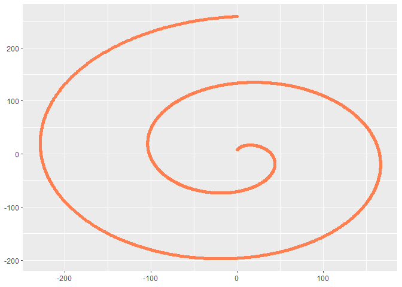
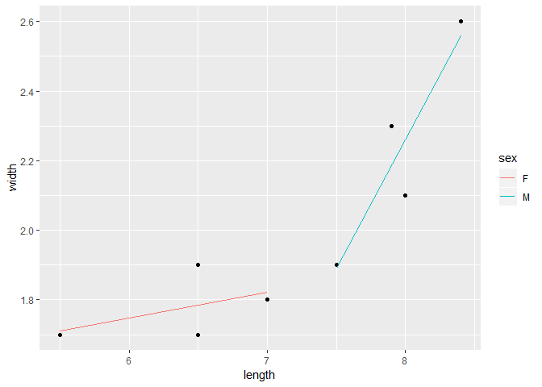

ggplot2 Extension for Fun
================
Yawei Ge, Zhenzhen Chen, Weiquan Luo
3/22/2019

[](https://travis-ci.org/yaweige/ggfun) [](https://codecov.io/github/yaweige/ggfun?branch=master) [](https://www.repostatus.org/#active)

Overview
========

This package `ggfun` was created as an extension of `ggplot2` to add some functions for some specific goals, such as replacing points with images, making it more convenient to deal with map in some cases, generating some curves with given parameters, etc. But it is really an excercise for applying ggplot2 extension functionalities and there is large space to improve.

Here is a link to our GitHub [repository](https://github.com/yaweige/ggfun) where the code for the package is stored.

Installation
============

The package can be downloaded from GitHub. You can use the following code to install.

``` r
# Install the package from github
devtools::install_github("yaweige/ggfun")
```

You can then load the package in the normal way.

``` r
# Load the package
library(ggfun)
```

Functions
=========

### `geom_image`

This function is used to draw scatter plot as `geom_point` does, but replaced the points with a predefined image (Elephant and donkey).

The usage is the same as `geom_image`.

``` r
library(ggplot2)
library(ggfun)
library(dplyr)

ggplot(mtcars, aes(wt, mpg)) + geom_image()
```


### `stat_star`

This function applied the algorithm to calculate the distances between the central point (defined by median) and other points, and connect the central point to the farthest point with a line, which can be modified as a regular line object in `ggplot2`.

``` r
madedata <- data.frame(x = rnorm(100, mean = 0, sd = 1),
                       y = rnorm(100, mean = 0, sd = 1))


ggplot(madedata, aes(x = x, y = y)) +
  geom_point() +
  stat_star(color = "red")
```


### `stat_arrowmap`

This function can draw arrow maps for the US. This function requres a specific type of data set, which generated as in the examples, with longutude, latitude and change which usually refers to the changes of party preference in US election for each state.

The required aesthetics are:

-   `x`: usually longitude
-   `y`: usually latitude
-   `change`: the changes for each state (can be specified by group aesthetics, as one state by default).

Other features can be modified similar to `geom_curve`.

``` r
usmap <- map_data("state")
madedata <- data.frame(region = unique(usmap$region), 
                                change = (runif(49)-0.5)*2,stringsAsFactors = FALSE)
madedata <- madedata %>%
  left_join(usmap,by = "region")
```

``` r
madedata %>%
  ggplot() +
  geom_path(aes(x = long, y = lat, group = group)) +
  stat_arrowmap(aes(x = long, y = lat, change = change, group = region),
                curvature = 0.3, angle = 60,
                size = 1,
                arrow = arrow(type = "open",
                              length = unit(0.1, "inches")))
```


### `layer_PersHomo`

Persistant Homoly of earthquark around pacific plate

``` r
library(magrittr) 
worldmap <- map_data("world2")
p <- ggplot() +
  geom_polygon(data=worldmap, aes(x=long, y=lat, group = group),fill="white", colour="#7f7f7f", size=0.5) +
  theme(axis.line=element_blank(),
        axis.text.x=element_blank(),
        axis.text.y=element_blank(),
        axis.ticks=element_blank(),
        axis.title.x=element_blank(),
        axis.title.y=element_blank(),
        legend.position="none",
        panel.background=element_blank(),
        panel.border=element_blank(),
        panel.grid.major=element_blank(),
        panel.grid.minor=element_blank(),
        plot.background=element_blank())
data(eqRaw)
eq <- eqRaw %>% filter(LONGITUDE > 110 | LONGITUDE < -45) %>%
  mutate(LONGITUDE = ifelse(LONGITUDE < 0, LONGITUDE + 360, LONGITUDE)) %>%
  select(YEAR, MONTH,DAY, EQ_MAG_MS, COUNTRY, LOCATION_NAME, LATITUDE, LONGITUDE)
## add layer_PersHomo
fp <- p + layer_PersHomo(data= eq, mapping = aes(x=LONGITUDE, y=LATITUDE), d=450000, colour = "blue"); fp
```


### `stat_ars`

This function applied the algorithm to calculate the Archimedean spiral. Then we apply `ggplot2` to connect each point to draw a spiral.

``` r
ggplot() +
   stat_ars(aes(a = 8, b = 20, n = 2), col = "coral")
```



### `stat_rl`

This function is used to draw regression line for the each level of the categorical variable.

``` r
ggplot(indexf, aes(x = length, y = width, id = sex)) +
 geom_point() +
 stat_rl(aes(x = length, y =  width, id = sex, colour = sex))
```


